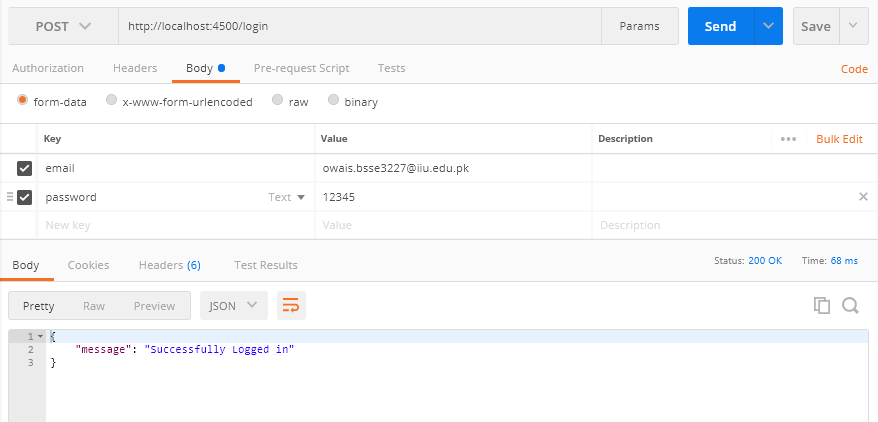
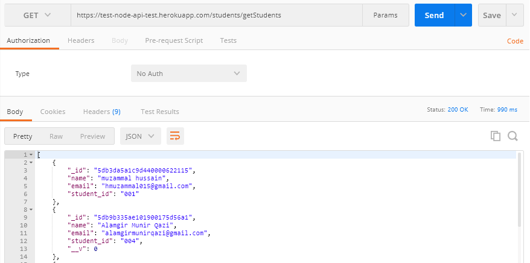
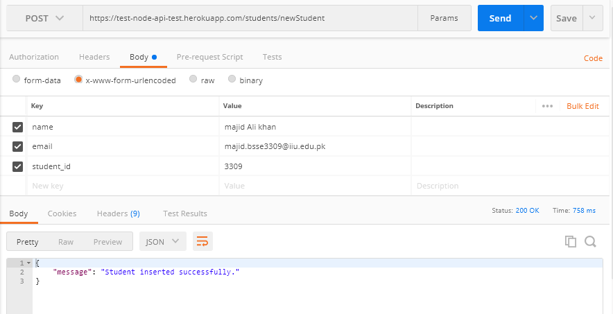
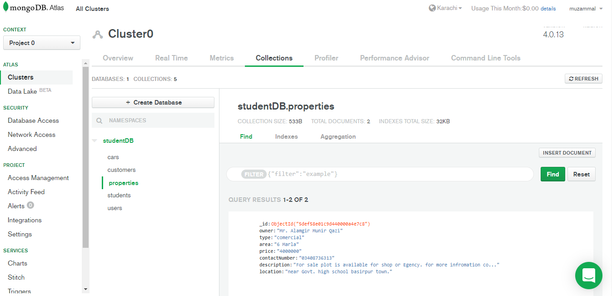
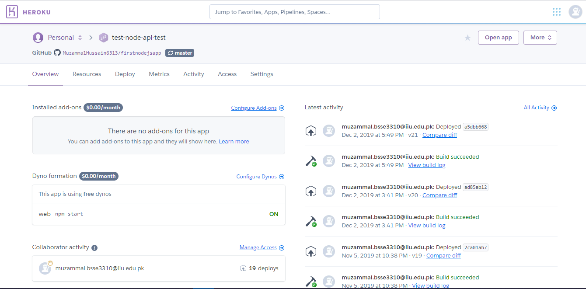

# firstnodejsapp Node API have following features.
Node REST API using mongoDB.
<ul>
 <li>Create a new User.</li>
<li>Update Existing User.</li>
<li>Read  a List of users OR single user by id.</li>
<li>Delete existing user.</li>
<li>login</li>
<li>signup</li>
</ul>

Connected with online cluster of mongodb.
<ul>
  <li>app is deployed in heroku.</li>
  <li>API have following endpoints.</li>
</ul>
<ol>
  Home Page of API
  <li><a href = "https://test-node-api-test.herokuapp.com/">https://test-node-api-test.herokuapp.com</a></li>
  Get method to get All Students.
  <li><a href = "https://test-node-api-test.herokuapp.com/students/getStudents">https://test-node-api-test.herokuapp.com/students/getStudents</a></li>
  Get method to get student by id.
  <li><a href = "https://test-node-api-test.herokuapp.com/students/{id}">https://test-node-api-test.herokuapp.com/students/{id}</a></li>
  Patch method to Update existing user by providing id of student.
  <li><a href = "https://test-node-api-test.herokuapp.com/students/{id}">https://test-node-api-test.herokuapp.com/students/{id}</a></li>
  Dlete method to Delete existing usetr by providing the id of student.
  <li><a href = "https://test-node-api-test.herokuapp.com/students/{id}">https://test-node-api-test.herokuapp.com/students/{id}</a></li>
</ol>  

 
Login the page
 
 
 

 
Get List of Students
 
 
 

 
Add New Student
 
 
 

 
Online Database Cluster
 
 
 

Server to deploye the API.
 
 
